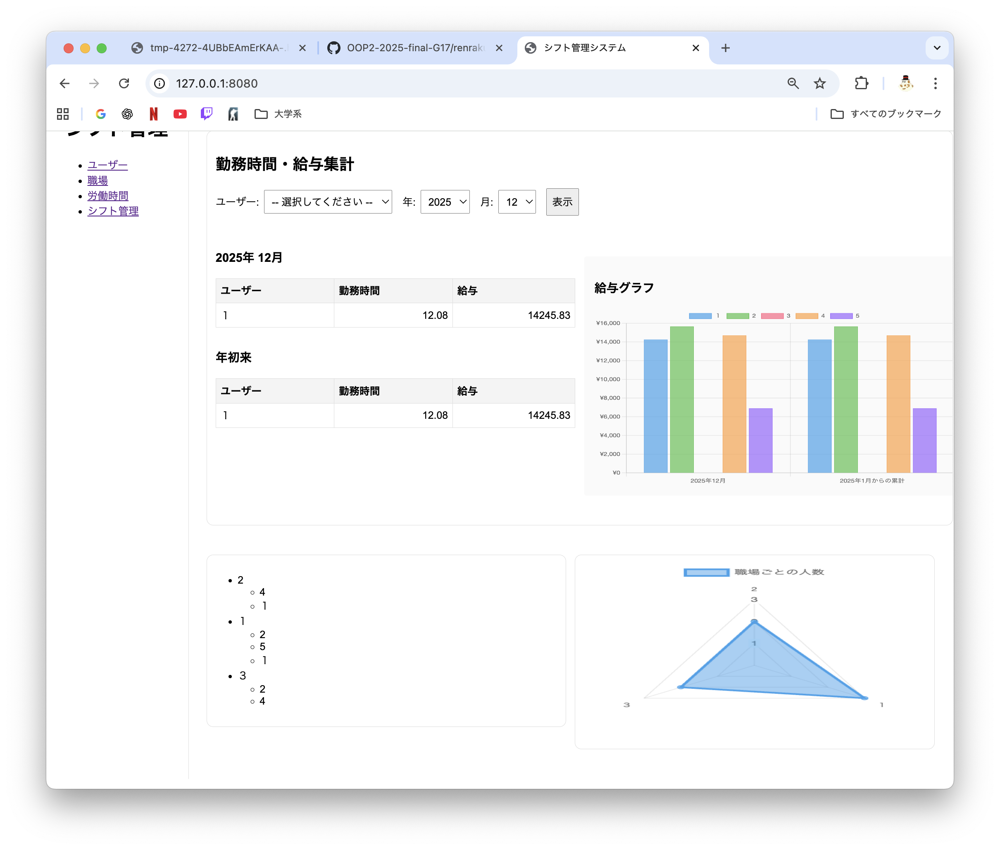

## 1.データ登録アプリケーションにて登録するデータと集計しトップページに載せる情報の詳細
### 登録するデータ
- ユーザー : 名前、年齢
- 職場 : 職場名、時給
- 労働時間 : 時間名、開始時間、終了時間、休憩開始時間、休憩終了時間

### トップページに載せる情報の詳細
- 今日のシフト

    ・今日のシフトがある場合ここに表示される
- カレンダーシフト表
    
    ・シフトがある日にそのユーザの名前が表示される
- 勤務時間・給与集計

    ・ユーザ別の勤務時間と給与が選択した月および年の初めからの合計が表およびグラフとして表示される
- 職場の人リスト

    ・職場ごとに働いている人をリスト形式で表示される。
- 職場の人数レーダーチャート

    ・職場の人数のレーダーチャートが表示される。

## 2.自分が担当した部分の説明

## 3.レビューを行ったグループメンバーのPullRequestのURL
https://github.com/OOP2-2025-final-G17/oop2-2025-G17-w10/pull/6
- 不要な変数を消し、名称を変更

https://github.com/OOP2-2025-final-G17/oop2-2025-G17-w10/pull/7
- groupsを追加

https://github.com/OOP2-2025-final-G17/oop2-2025-G17-w10/pull/8/files
- レーダーチャート作成について

https://github.com/OOP2-2025-final-G17/oop2-2025-G17-w10/pull/9
- ユーザーごとの勤務時間、給与をグラフで表示

https://github.com/OOP2-2025-final-G17/oop2-2025-G17-w10/pull/10
- ホーム画面に今日のシフトを確認できる機能を追加

https://github.com/OOP2-2025-final-G17/oop2-2025-G17-w10/pull/11
- 冗長コードを整理

https://github.com/OOP2-2025-final-G17/oop2-2025-G17-w10/pull/12
- 給与集計の可視化と職場ごとのユーザー管理

https://github.com/OOP2-2025-final-G17/oop2-2025-G17-w10/pull/13
- 管理画面のサイドバー、コンテンツの表示の管理

https://github.com/OOP2-2025-final-G17/oop2-2025-G17-w10/pull/14
- レイアウトを整えた

https://github.com/OOP2-2025-final-G17/oop2-2025-G17-w10/pull/15
- 月単位のカレンダーでシフトを可視化

https://github.com/OOP2-2025-final-G17/oop2-2025-G17-w10/pull/16
- 職場名＋時間を含む全シフトを表示可能にした

## 4. ある程度のデータ登録がされた状態での画面のスクリーンショット

## 5. 感想
- プルリクエストがたくさん来て、処理が間に合わなくなっていき、とても大変でした。
山中くんと中山くんがたまに空いている時間で手伝ってくれていましたが、２人にできるだけ負荷をかけないように自分でやるようにしていたので、とても大変でした。